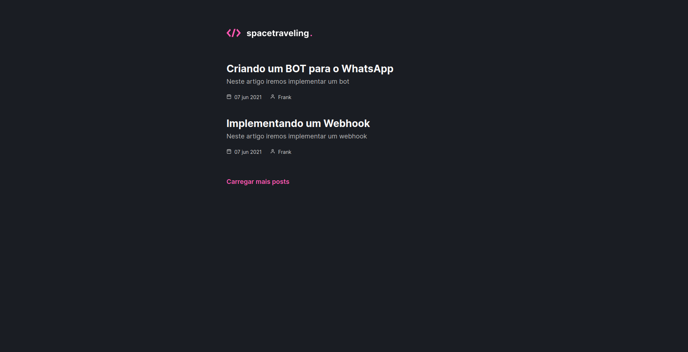
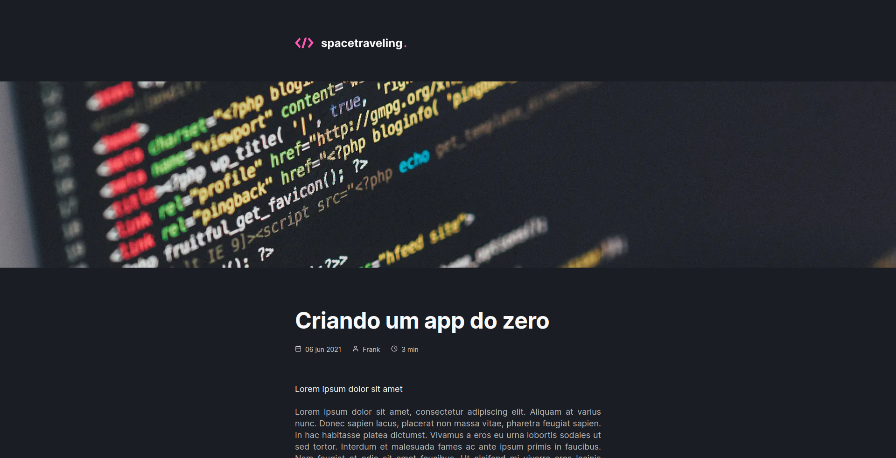
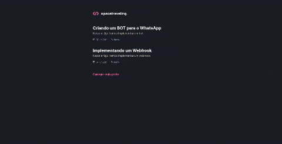

<h2 align="center"> 
   
</h1>

<p align="center">
  <a href="https://www.linkedin.com/in/frank-laercio/">
    
  </a>
  
  
  
  <a href="https://github.com/franklaercio/ig-news/commits/master">
    
  </a>
  
  

  
   <a href="https://github.com/franklaercio/spacetraveling/stargazers">
    
  </a>
</p>

## :bookmark_tabs: Resume of application

This application is a blog, in it you can publish your posts in a CMS tool and it will be quickly available to users. On the home page, there is a listing of posts, title, publication date and the author's name. In posts it is possible to find a pattern of first appearing the banner, then the title, publication date, author's name and estimated reading time. In addition, this project was developed during the Ignite of [Rocketseat](https://rocketseat.com.br/).

<p align="center">
  
  
  
</p>

## 🎲 Running the project

```bash
# Clone this repository
$ git clone https://github.com/franklaercio/spacetraveling

# Access the project folder in the terminal/cmd
$ cd spacetraveling

# Run the application
$ yarn dev
```

## :man_technologist: Authors

* **Frank Laércio** - [franklaercio](https://github.com/franklaercio)

See also the list of [contributors](https://github.com/franklaercio/restaurant-react/contributors) who participated in this project.

## :clipboard: License

This project is licensed under the MIT License - see the [LICENSE.md](LICENSE.md) file for details

## :newspaper: Acknowledgments

- Next.js
- Prismic
- Sass
- Typescript

Feito com :hearts: by Frank Laércio :wave:!
